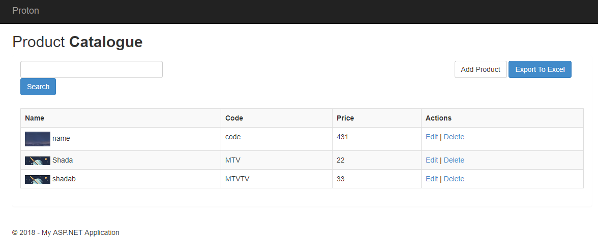

# Proton

Proton is product catalogue managment application

Application is divided in three parts
- WebApp : Called proton has service repository to communicate with Product API
- Web API : Contains various product managment restfull API and uses DataAccessLayer for communication with DB
- DAL : DataAccessLayer is the core for communication with database and use EF to sync the DB

